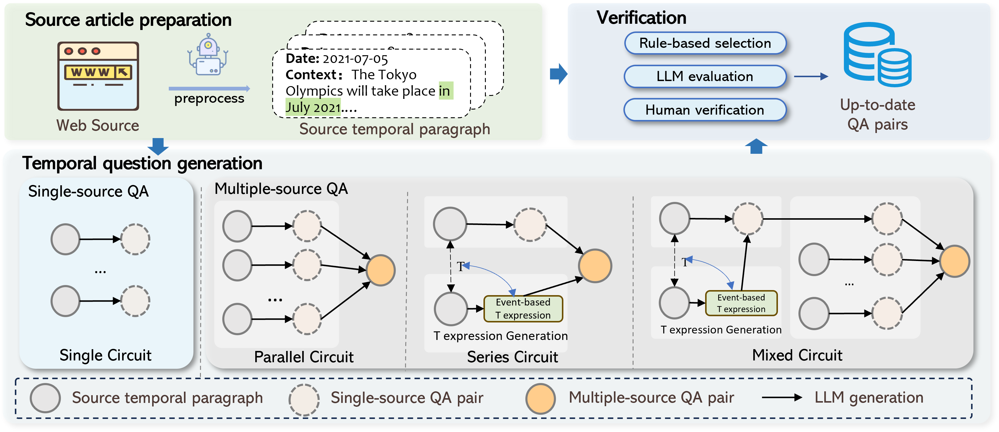
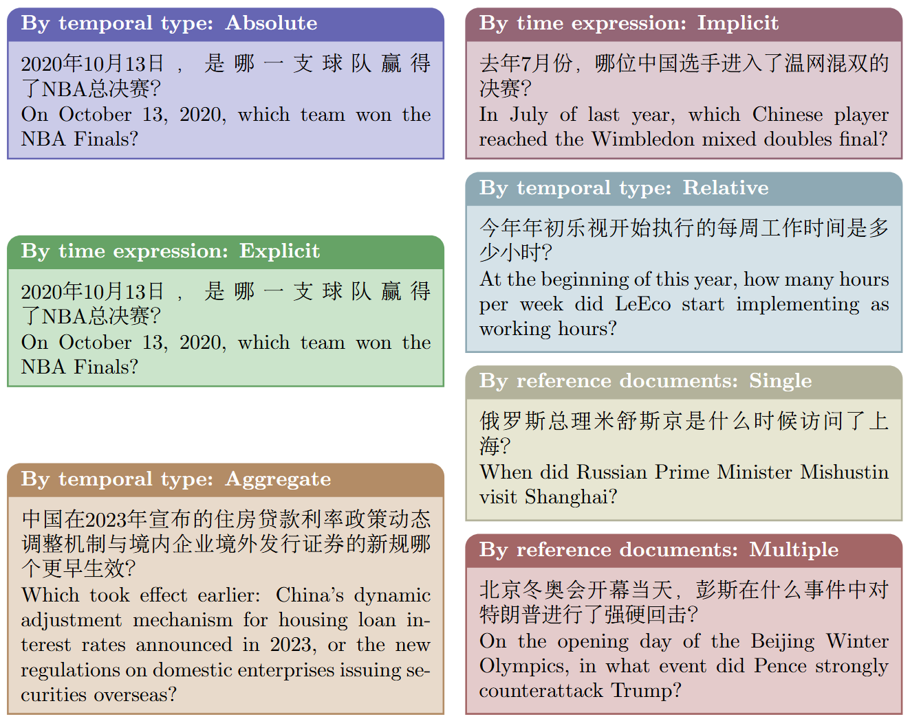

# ChronoQA - A Question Answering Dataset for Temporal-Sensitive Retrieval-Augmented Generation


ChronoQA is a temporal-sensitive question answering system for news data, capable of processing and analyzing news content, generating structured QA pairs, and supporting time-based queries.


## Key Features

- 📰 News crawling and cleaning
- 🔍 News summarization and knowledge graph extraction
- ❓ Multi-type question generation
- ⏳ Temporal sequence QA processing
- 🤖 Support for multiple LLM APIs

## Project Structure
```
ChronoQA/
├── scripts/                  # Core processing scripts
│   ├── data_process.py       # News data processing & batch handling
│   ├── news_crawer.py        # News crawling module 
│   ├── question_generation.py # Question generation
│   ├── api.py                # API wrappers
│   └── prompt.py             # Prompt templates
├── chronoqa.csv              # Csv dataset
├── chronoqa.json             # Json dataset
└── README.md                 # This file
```


## Dataset Overview

### Question Examples



ChronoQA contains diverse temporal question types including:
- Absolute time questions ("On October 13, 2020, which team won the NBA Finals?")
- Relative time questions ("At the beginning of this year, how many hours per week did LeEco implement?")
- Aggregate comparison questions ("Which took effect earlier: China's housing loan policy or new securities regulations?")
- Implicit time reference questions ("In July of last year, which Chinese player reached Wimbledon final?")

### Statistics

| Category              | Subcategory       | Count |
|-----------------------|-------------------|-------|
| **Temporal Type**     | Absolute          | 2,529 |
|                       | Aggregate         | 1,911 |
|                       | Relative          | 736   |
| **Temporal Scope**    | Long-term         | 1,946 |
|                       | Mid-term          | 2,736 |
|                       | Short-term        | 494   |
| **Time Expression**  | Explicit          | 2,000 |
|                       | Implicit          | 3,176 |
| **Total**            |                   | 5,176 |

## Data Format

The dataset follows this JSON structure:

```json
{
  "question": "Which event occurred earlier: COTODAMA speaker release or iPhone 6 discontinuation?",
  "question_date": "2024-10-30",
  "answer": "iPhone 6 discontinuation",
  "temporal_expression_type": "explicit",
  "temporal_scope": "long-term",
  "temporal_granularity": "day",
  "temporal_type": "aggregate",
  "answer_type": "entity",
  "reference_document_count": "multiple",
  "golden_chunks": [
    "On July 23, 2019, COTODAMA released...",
    "On July 17, 2019, Apple announced..."
  ]
}

```

## Quick Start

### Prerequisites

1. Python 3.8+
2. Install dependencies:

```bash
pip install -r requirements.txt
```

1. Create .env fill your API keys:
```plaintext
ZHIPU_API_KEY=your_api_key_here
LLM_API_KEY=your_api_key_here
GTE_API_KEY=your_api_key_here
```

### Usage
1. News crawling:
```python
python scripts/news_crawer.py
 ```

 Note: The full pre-processed news passages (300k) have been saved in vector DB ([ChromaDB](https://docs.trychroma.com/)). You can use it to generate QA pairs or to query the database. Download the database from [here](hhttps://drive.google.com/file/d/1ZyrRbHnAbVabt9AaVMbrY7IXWLM-ypMH/view?usp=sharing).

1. Question generation:
```python
python scripts/question_generation.py
 ```


## License
 CC BY 4.0 license. 