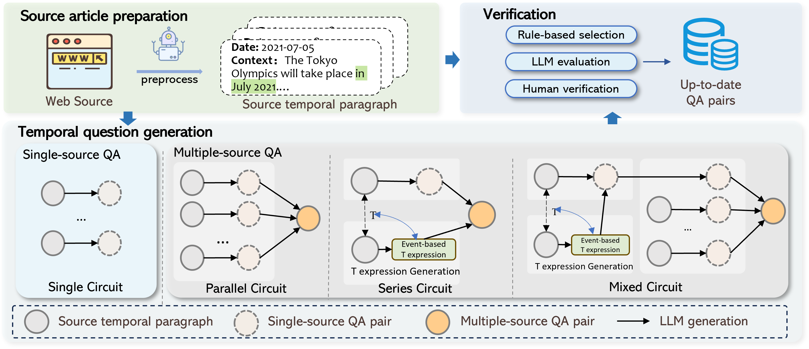
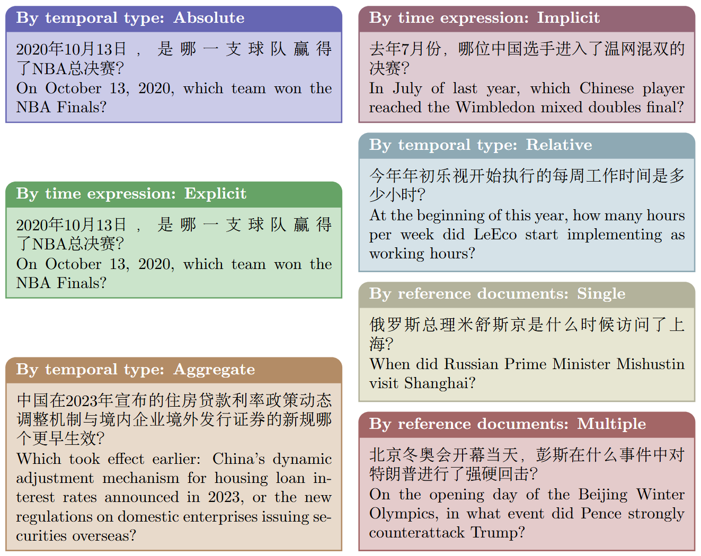

# ChronoQA - A Question Answering Dataset for Temporal-Sensitive Retrieval-Augmented Generation


ChronoQA is a temporal-sensitive question answering system for news data, capable of processing and analyzing news content, generating structured QA pairs, and supporting time-based queries. [Paper](https://www.nature.com/articles/s41597-025-06098-y) [Dataset](https://doi.org/10.5281/zenodo.17163857)


> **News! 🎉** Our evaluation and baseline code is now open-sourced at: [https://github.com/czy1999/ChronoReflect](https://github.com/czy1999/ChronoReflect)


## Key Features

- 📰 News crawling and cleaning
- 🔍 News summarization and knowledge graph extraction
- ❓ Multi-type question generation
- ⏳ Temporal sequence QA processing
- 🤖 Support for multiple LLM APIs


## Project Structure
```
ChronoQA/
├── scripts/                   # Core processing scripts
│   ├── api.py                 # API wrappers
│   ├── news_crawer.py         # News crawling module 
│   ├── data_process.py        # News data processing & batch handling
│   ├── question_filter.py     # Question filter
│   ├── composite_question.py  # Functions for composite questions
│   ├── question_generation.py # Question generation
│   └── prompt.py              # Prompt templates
├── chronoqa.csv               # Csv dataset
├── chronoqa.json              # Json dataset
└── README.md                  # This file
```


## Dataset Overview

### Question Examples



ChronoQA contains diverse temporal question types including:
- Absolute time questions ("On October 13, 2020, which team won the NBA Finals?")
- Relative time questions ("At the beginning of this year, how many hours per week did LeEco implement?")
- Aggregate comparison questions ("Which took effect earlier: China's housing loan policy or new securities regulations?")
- Implicit time reference questions ("In July of last year, which Chinese player reached Wimbledon final?")

### Statistics

| Category              | Subcategory       | Count |
|-----------------------|-------------------|-------|
| **Temporal Type**     | Absolute          | 2,529 |
|                       | Aggregate         | 1,911 |
|                       | Relative          | 736   |
| **Temporal Scope**    | Long-term         | 1,946 |
|                       | Mid-term          | 2,736 |
|                       | Short-term        | 494   |
| **Time Expression**  | Explicit          | 2,000 |
|                       | Implicit          | 3,176 |
| **Total**            |                   | 5,176 |

## Data Format

The dataset follows this JSON structure:

```json
{
  "question": "Which event occurred earlier: COTODAMA speaker release or iPhone 6 discontinuation?",
  "question_date": "2024-10-30",
  "answer": "iPhone 6 discontinuation",
  "temporal_expression_type": "explicit",
  "temporal_scope": "long-term",
  "temporal_granularity": "day",
  "temporal_type": "aggregate",
  "answer_type": "entity",
  "reference_document_count": "multiple",
  "golden_chunks": [
    "On July 23, 2019, COTODAMA released...",
    "On July 17, 2019, Apple announced..."
  ]
  "golden_chunks_urls":["https://...", "https://..."]
}

```

## Quick Start

### Prerequisites

1. Python 3.8+
2. Install dependencies:

```bash
pip install -r requirements.txt
```

1. Create .env file in the root directory and fill your API keys:
```plaintext
LLM_API_KEY=your_api_key_here
LLM_API_BASE=your_api_url_here
GTE_API_KEY=your_api_key_here
```

### Usage
1. Clone the repository:
```bash
git clone https://github.com/czy1999/ChronoQA.git
cd ChronoQA
```

2. Create a directory to save the news data:  
```bash
mkdir data
```

3. News crawling:

select a date range to crawl news from sina
```bash
dbname = '20240801-20240802'
```

```python
python scripts/news_crawer.py
 ```

 Note: The full pre-processed news passages (300k) have been saved in vector DB ([ChromaDB](https://docs.trychroma.com/)). You can use it to generate QA pairs or to query the database. Download the database from this [link](https://drive.google.com/file/d/1j06xiEUl1evAmJMuPl5eJx3csFCNyQ2j/view?usp=drive_link).

4. Question generation:
```python
python scripts/question_generation.py
 ```
5. Question filtering:
```python
python scripts/question_filter.py
 ```

## Citation

If you find this code or our dataset useful for your research, please consider citing our paper:

```bibtex
@article{chen2025question,
  title={A Question Answering Dataset for Temporal-Sensitive Retrieval-Augmented Generation},
  author={Chen, Ziyang and Min, Erxue and Zhao, Xiang and Li, Yunxin and Jia, Xin and Liao, Jinzhi and Li, Jichao and Wang, Shuaiqiang and Hu, Baotian and Yin, Dawei},
  journal={Scientific Data},
  volume={12},
  number={1},
  pages={1855},
  year={2025},
  publisher={Nature Publishing Group UK London}
}
```
## License
 CC BY 4.0 license. 
